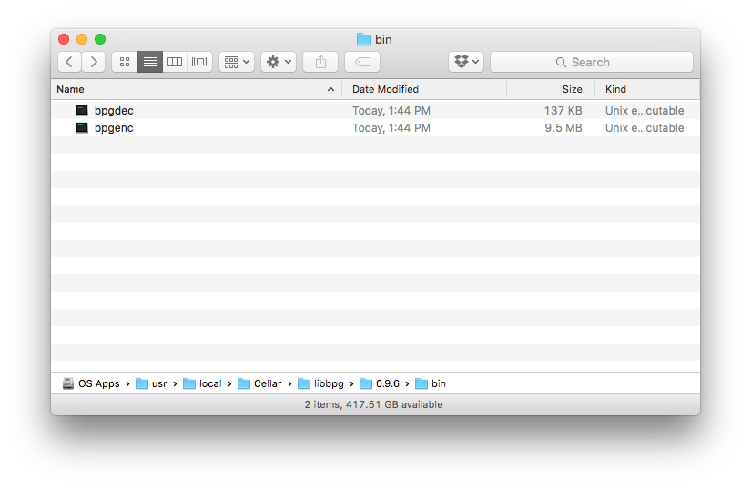
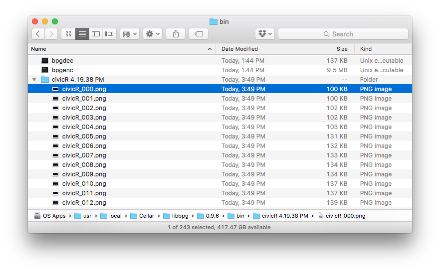
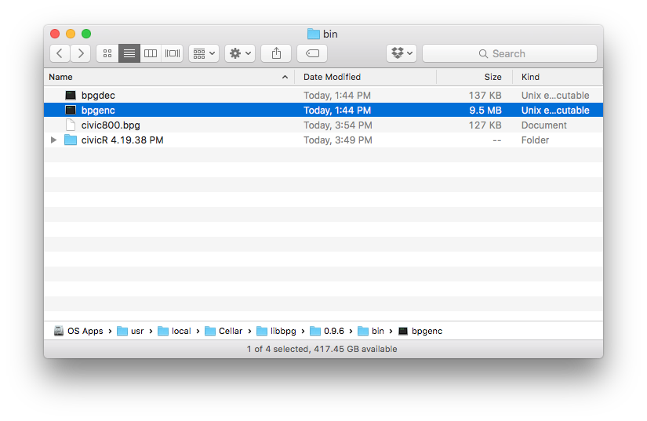

BPG Animations
=========================

Experiments with the .bpg image encoding and decoding workflow


##Homebrew Installation Instructions

for osx use libbpg in homebrew

```
brew install libbpg
```

###To encode a BPG
navigate to your homebrew bpg installation folder

Probably this

```
/usr/local/Cellar/libbpg/0.9.6/bin
```

inside you will find:


have an image sequence ready to convert to an animated .bpg
I have 240 frames of my civic image sequence in the folder here:


in the terminal cd to your bin and use the following command to turn the frames into an animation:
```
/bpgenc -a civicR/civicR_%3d.png -fps 25 -loop 0 -o civic800
```

you would get civic800.bpg in the bin


###Main options:

  -h                   show the full help (including the advanced options)
  -o outfile           set output filename (default = out.bpg)
  -q qp                set quantizer parameter (smaller gives better quality,
                       range: 0-51, default = 29)
  -f cfmt              set the preferred chroma format (420, 422, 444,
                       default=420)
  -c color_space       set the preferred color space (ycbcr, rgb, ycgco,
                       ycbcr_bt709, ycbcr_bt2020, default=ycbcr)
  -b bit_depth         set the bit depth (8 to 12, default = 8)
  -lossless            enable lossless mode
  -e encoder           select the HEVC encoder (x265, default = x265)
  -m level             select the compression level (1=fast, 9=slow, default = 8)

  Animation options:
  -a                   generate animations from a sequence of images. Use %d or
                       %Nd (N = number of digits) in the filename to specify the
                       image index, starting from 0 or 1.
  -fps N               set the frame rate (default = 25)
  -loop N              set the number of times the animation is played. 0 means
                       infinite (default = 0)
  -delayfile file      text file containing one number per image giving the
                       display delay per image in centiseconds.


Official information on the .bpg format and where to download the .js decoder
http://bellard.org/bpg/
